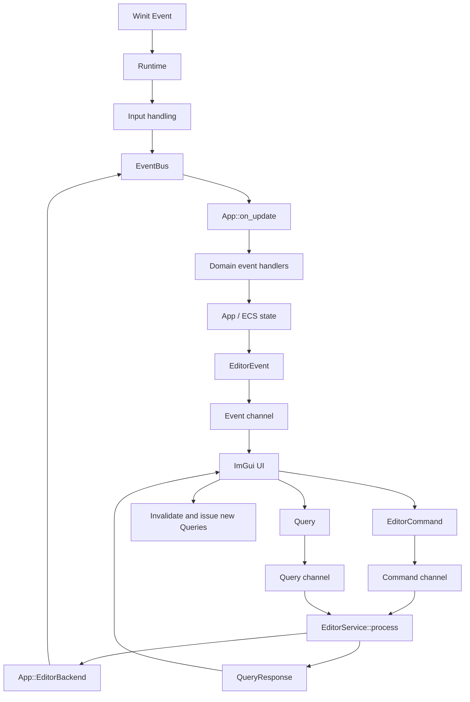
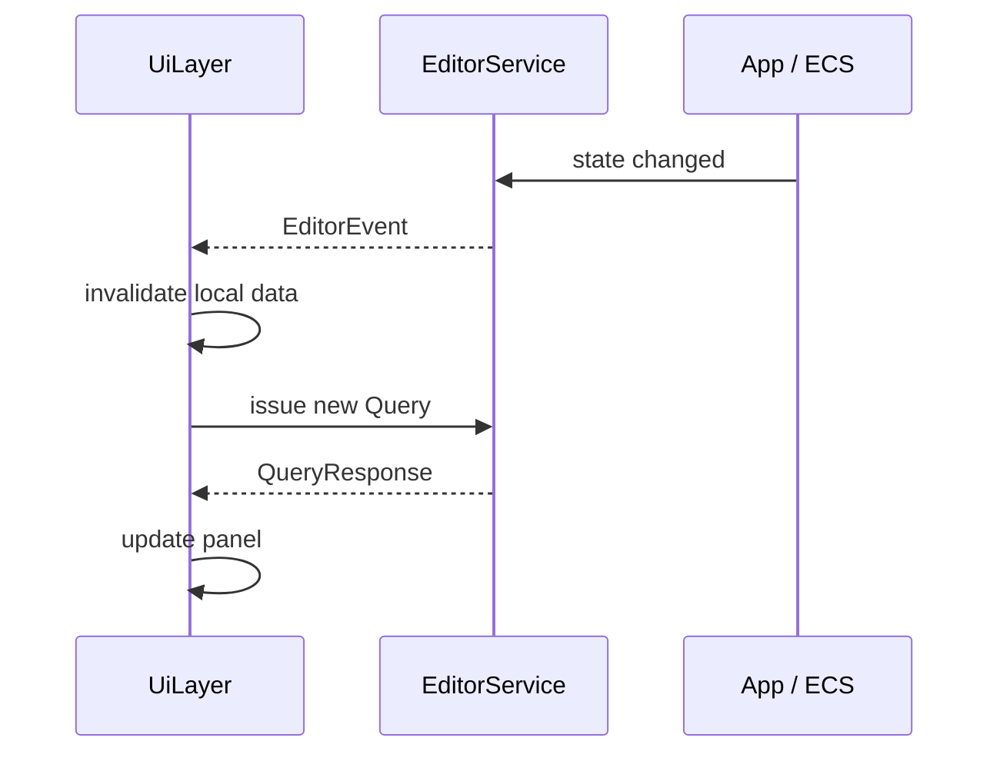
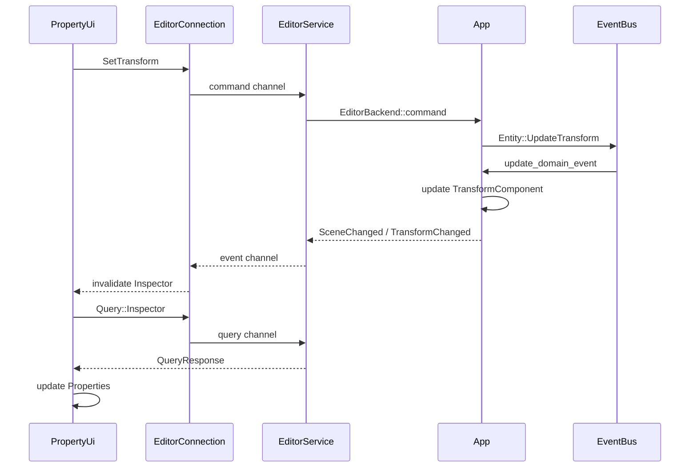

This document describes how the ImGui UI communicates with the runtime, engine, and application state.

## General Flow



## Main Actors

- **ImGui UI**: panels in `src/ui` display received state and produce commands or queries in response to user interactions.
- **`EditorConnection`**: exposes command and query clients, plus event and response receivers, to the UI. The underlying channels are created with `std::sync::mpsc`.
- **`EditorService`**: adapts between the UI channels and the application. It processes commands, responds to queries, and detects changes in editor state.
- **`EventBus`**: contains two internal queues, one for domain events and one for runtime events.
- **`App`**: implements `EditorBackend`, applies domain events, and provides the data requested by the UI.
- **`Runtime`**: coordinates input, runtime events, UI updates, GPU synchronization, and rendering.

## Frame Lifecycle

```mermaid
flowchart LR
    E[Engine::tick] --> I[Runtime::handle_input]
    I --> RE[Runtime::handle_runtime_events]
    RE --> U[App::on_update]
    U --> G[Runtime::sync_gpu_assets]
    G --> UI[Runtime::update_ui]
    UI --> P[EditorService::process]
    P --> B[UiLayer::build]
    B --> R[Runtime::render]
```



`Engine::tick` is invoked by `MyApplication::window_event` when a `WindowEvent::RedrawRequested` event arrives.

During `App::on_update`, `App::update_domain_event` drains the domain-event queue and delegates events to the domain-layer handlers. The scene is updated afterwards.

## UI-to-Engine Communication

UI panels use `UiContext`, created by `UiLayer`, to access the editor connection.

An interaction that changes state sends an `EditorCommand`:

```text
UI
  -> EditorCommand
  -> command channel
  -> EditorService::process
  -> App's EditorBackend
  -> DomainEvent
  -> EventBus
  -> domain-layer handler
  -> App / ECS state
```

For example, `PropertyUi` handles a transform edit by sending:

```text
BeginTransformEdit
SetTransform
EndTransformEdit
```

The `SetTransform` command is converted into `EntityEvent::UpdateTransform`, inserted into the `EventBus`, and applied to `TransformComponent` by `handle_entity_event`.

Commands are consumed by `EditorService::process`, which runs during `Runtime::update_ui`. Because the UI is built after `process`, a command emitted during `UiLayer::build` is normally processed in the following frame.

## UI Queries and Responses

The UI uses queries to read application data without directly accessing the ECS state. Available queries include:

- `Hierarchy`
- `Selection`
- `Inspector`
- `Settings`
- `Statistics`

Each query receives a `QueryId`, which associates the response with the most recent request for that query slot.

```text
Query
  -> query channel
  -> EditorService::process
  -> App::EditorBackend::query
  -> QueryResponse
  -> response channel
  -> UiLayer::process_connection
  -> local UI state
  -> ImGui panels
```

`EditorService` answers queries through `EditorBackend::query`. Statistics are an exception: the service owns them and the runtime updates them before queries are processed.

`UiLayer::process_connection` ignores responses that do not match the latest `QueryId` registered for the relevant slot. This prevents an old response from overwriting newer data.

## Model-to-UI Events

`EditorService` compares the current state with the state observed in the previous frame. It can send events for:

- entities being created or deleted;
- changes to the scene revision;
- changes to the selection;
- modified transforms, names, or lights;
- updated settings or statistics.



The UI does not necessarily receive the complete updated state in the event. It often receives an invalidation event and retrieves the data through a new query.

Examples:

- `SceneChanged`, `EntityCreated`, or `EntityDeleted` cause a full invalidation and new queries for the hierarchy, selection, settings, and statistics.
- `SelectionChanged` updates the selection and requests the inspector for the first selected entity.
- `TransformChanged` updates the current inspector or requests the entity data again.
- `SettingsChanged` and `StatisticsChanged` invalidate only their respective slots.

## Viewport Input

Winit events are forwarded to the `Runtime`. They are first passed to ImGui; if ImGui is not capturing the mouse, the runtime updates the `Input` system.

```text
Mouse / keyboard
  -> Runtime::handle_winit_event
  -> Runtime::handle_input
  -> CameraEvent or SelectionEvent
  -> EventBus.domain
  -> App::on_update
  -> App::update_domain_event
  -> camera, selection, or scene state
```

GPU picking is asynchronous. `ReadbackManager` returns results later, and the runtime converts them into events such as `Hovered`, `Select`, or `SelectMulti`.

## Two Communication Mechanisms

The two communication mechanisms have different responsibilities:

- **`EditorConnection`**: asynchronous communication between the UI and `EditorService`, using MPSC channels for commands, queries, responses, and editor events.
- **`EventBus`**: internal queue-based communication between the runtime, application, and domain layer. It separates `DomainEvent` from `RuntimeEvent`.

This separation keeps the UI decoupled from the ECS: the UI knows the editor data types and commands, but does not directly manipulate the Legion world.

## Complete Example: Transform Editing



In summary, the UI sends intentions through commands, the application translates them into domain events, and the domain handlers modify application state. The UI observes changes through editor events and retrieves updated data through queries.

## Code References

- [`src/ui/ui_layer.rs`](../src/ui/ui_layer.rs): UI state, queries, and reception of responses and events.
- [`src/editor.rs`](../src/editor.rs): command, query, response, event, and channel types.
- [`src/engine/editor.rs`](../src/engine/editor.rs): `EditorService` and its adapter to `EditorBackend`.
- [`src/engine/engine.rs`](../src/engine/engine.rs): `EventBus`, `Engine`, and the main loop.
- [`src/engine/runtime.rs`](../src/engine/runtime.rs): input, UI updates, and rendering.
- [`src/app/app_impl.rs`](../src/app/app_impl.rs): `Application` and `EditorBackend` implementations for `App`.
- [`src/app/domain/handlers.rs`](../src/app/domain/handlers.rs): application of domain events to application state.


